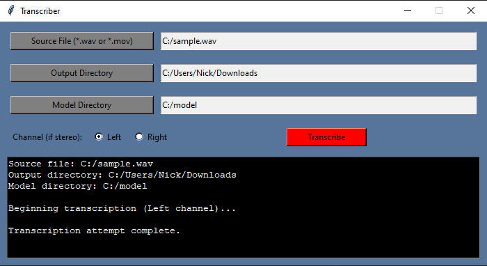

# Transcriber
A speech-to-text desktop application.  Transcriber consumes an audio sample, converts it into a transcription, and 
outputs the result to a text file.

The speech recognition package used under-the-hood is Vosk.  You can learn more here: https://alphacephei.com/vosk/

### Quickstart
1. Download a pre-trained model from Vosk's website.  The smaller model "vosk-model-small-en-us-0.15" is recommended.  You can find pre-trained models here: https://alphacephei.com/vosk/models
2. Run main.py to start the GUI.
3. Click the "Source File" button to select an audio sample you wish to transcribe.  .wav and .mov are currently supported.
4. Click the "Output Directory" button to select the folder to which the transcription .txt file will be written.
5. Click the "Model Directory" button to select the Vosk model previously downloaded to your local machine.
6. If your audio is in stereo format, you may select the channel you wish to transcribe.  Mono format will simply ignore this selection.
7. Click "Transcribe" to begin the transcription.
8. The diagnostic log at the bottom will indicate when the transcription is complete.  When this occurs, the transcription .txt file should be located in the directory specified earlier.

